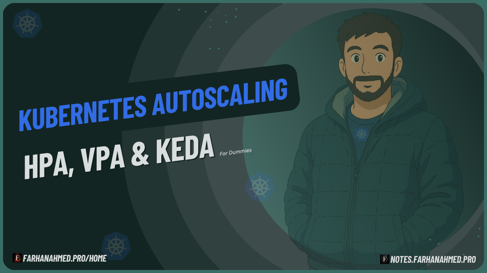
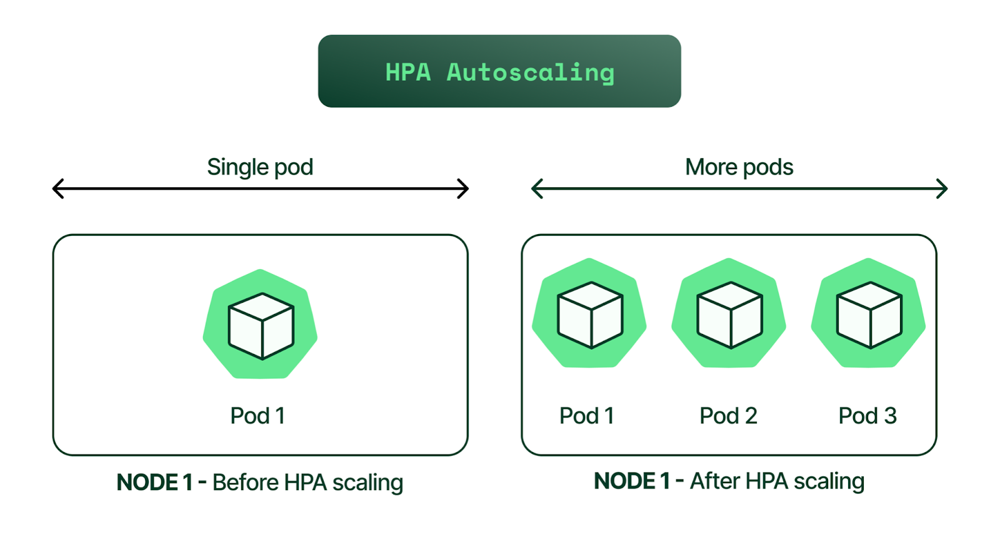
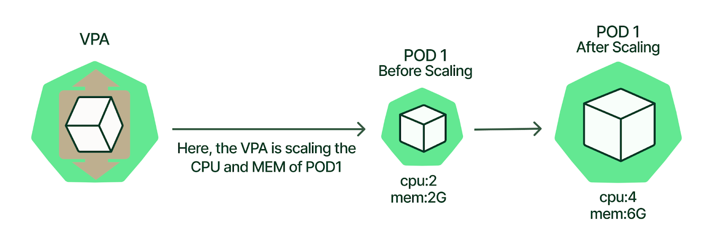
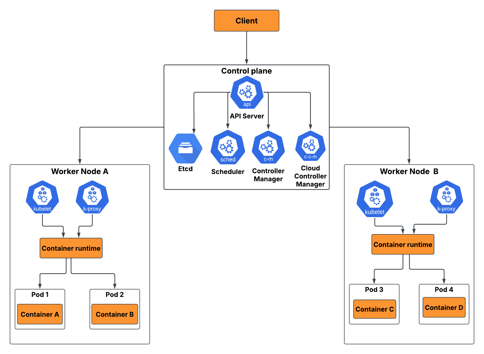

# Kubernetes Autoscaling - A Complete Overview

Hello everyone!!

Welcome to my blog today where we will explore **Kubernetes autoscaling**. I have been learning Kubernetes for a while now, and every time I learn something new, more information occurs to me. It feels like I can never stop learning about Kubernetes!

I was thoroughly practicing Kubernetes where I was able to create pods, services, deployments, etc., and I know that I can manually replicate pods by changing the replica count in the deployment file. But what if I want to automate this process based on the load on my application?

I was still in the process of learning when I came across the concept of **Kubernetes autoscaling**.

<!-- truncate -->

## 📊 What is Scaling?

I assume that we know what scaling is. **Scaling** is the process of adjusting the resources allocated to an application or service to meet changing demands. In the context of Kubernetes, scaling refers to the ability to increase or decrease the number of pod replicas running in a cluster based on various factors such as CPU utilization, memory usage, or custom metrics.

### Types of Scaling

| Scaling Type | Description | Also Known As |
|--------------|-------------|---------------|
| **Horizontal Scaling** | Adding or removing instances of an application | Scale Out/In |
| **Vertical Scaling** | Increasing or decreasing resources (CPU, memory) allocated to existing instances | Scale Up/Down |

**Kubernetes autoscaling** is a powerful feature that allows your applications to automatically adjust the number of running instances (pods) based on the current demand. This means that when your application experiences high traffic, Kubernetes can automatically increase the number of pods to handle the load, and when the traffic decreases, it can scale down the number of pods to save resources.

## 🔧 Types of Autoscaling in Kubernetes

I began to learn that there are **three main types** of autoscaling in Kubernetes:

### 1. Horizontal Pod Autoscaler (HPA)

**HPA** adjusts the number of pod replicas in a deployment based on observed CPU utilization or other select metrics. For example, if the CPU usage of your application exceeds a certain threshold, HPA can increase the number of pods to distribute the load.

### 2. Vertical Pod Autoscaler (VPA)

Unlike HPA, which changes the number of pods, **VPA** adjusts the resource requests and limits (CPU and memory) of individual pods. This is useful when your application needs more resources to handle increased load without changing the number of pods.

> ℹ️ **Note**: HPA and VPA happen at the **pod level**. There is also another autoscaler which happens at the **node level** (which we will discuss in upcoming blogs).

## 📈 How Autoscaling Works with Metrics

I understood that HPA and VPA are implemented by certain metrics that Kubernetes fetches from the pods.

### HPA Metrics
- **Most common metric**: CPU utilization
- **Other metrics**: Memory usage, request latency, custom metrics
- You can define target metrics in the HPA configuration
- Kubernetes monitors these metrics to make scaling decisions

### VPA Metrics
- Uses **historical resource usage data** (CPU and memory usage over time)
- Recommends or automatically adjusts resource requests and limits for pods
- Helps ensure your application has the right amount of resources to perform optimally

I think so far we have a fair idea that we can autoscale our Kubernetes applications using HPA or VPA based on certain metrics. And you don't have to manage them manually... Kubernetes will take care of it for you!

## 💰 Why Use Autoscaling?

But it's not that we can use these features of Kubernetes just to prevent running out of resources. I mean, it is one of the reasons. But the actual reason is **efficiency and cost-effectiveness**.

By automatically scaling your applications based on demand, you can ensure that you are using resources efficiently, which can lead to cost savings, especially in cloud environments where you pay for the resources you consume.

## 🏗️ Kubernetes Architecture and Autoscaling

Let's go back to Kubernetes architecture for a moment. We know that Kubernetes has a **control plane** and **worker nodes**:

- **Control plane**: Manages the overall state of the cluster
- **Worker nodes**: Handle the application workloads
- **Autoscaling components**: HPA controller and VPA recommender run as part of the control plane
- They continuously monitor metrics from pods and make scaling decisions based on defined policies in real-time

## ⚠️ Best Practices and Considerations

It's great to see that Kubernetes autoscaling is a powerful feature that allows your applications to automatically adjust their resource allocation based on demand. By leveraging HPA and VPA, you can ensure that your applications remain responsive and efficient, even during periods of fluctuating traffic.

But like it's said, **with great power comes great responsibility**.

:::warning Important Considerations
Autoscaling should be used judiciously. Improper configuration of autoscaling policies can lead to:
- Resource wastage
- Application instability
- Increased costs
:::

### Key Points to Remember:
- **Monitor** autoscaling behavior and fine-tune policies as needed
- It's not just about application performance - it impacts **costs** too
- In cloud environments, resources are billed based on usage
- **Careful planning and monitoring** are essential
- You need to:
  - Right-size your resources
  - Avoid idle resources
  - Choose appropriate node types to optimize costs

## 🎯 Custom Metrics and Advanced Autoscaling

So far we have discussed HPA and VPA. But have you ever thought - are the metrics used for autoscaling enough? What if we want to use **custom metrics** for autoscaling?

Kubernetes allows you to define and use **custom metrics** for autoscaling through:
- **Kubernetes Metrics Server**
- **Custom metrics adapters**

This enables you to scale your applications based on application-specific metrics that are more relevant to your use case.

That's good that we can use custom metrics for autoscaling. But what if we have an autoscaling tool that has more options to scale our applications?

## 🚀 KEDA - Event-Driven Autoscaling

That is where **KEDA (Kubernetes Event-Driven Autoscaling)** comes into the picture!

**KEDA** is an open-source project that extends the capabilities of Kubernetes autoscaling by allowing you to scale applications based on **event-driven metrics**.

### KEDA Features:
- Supports a wide range of **event sources**:
  - Message queues
  - Databases
  - Custom events
- Makes it a versatile choice for autoscaling in various scenarios
- Extends native Kubernetes autoscaling capabilities

## 🎯 Conclusion

Kubernetes autoscaling is a powerful feature that enables your applications to automatically adjust their resource allocation based on demand. By leveraging:

- **Horizontal Pod Autoscaler (HPA)**
- **Vertical Pod Autoscaler (VPA)**
- **Tools like KEDA**

You can ensure that your applications remain responsive and efficient, even during periods of fluctuating traffic. However, it is important to use autoscaling judiciously and monitor its behavior to ensure optimal performance and cost-effectiveness.

## 🔮 What's Next?

In upcoming blogs, we will explore more about:
- **Internals of HPA**
- **KEDA implementation**
- **How to implement autoscaling in Kubernetes clusters**

My intention with this blog was to give you a brief overview of Kubernetes autoscaling. I hope you found this blog informative and helpful! If you have any questions or comments, feel free to leave them below or DM me on LinkedIn.

I have planned a **series of blogs** on Kubernetes autoscaling where I will deep dive into each of these topics. Stay tuned for more updates! Thank you for reading!

> 📚 **For practical implementation**: Check out my detailed notes on Kubernetes autoscaling in my [knowledge base](https://notes.farhanahmed.pro)

---

## 🤝🏻 Stay Connected

If you find the content helpful, consider:

- Following me on [GitHub](https://github.com/itsfarhan)
- Connecting on [LinkedIn](https://linkedin.com/in/itsfarhan)
- [Supporting my work](https://ko-fi.com/itsfarhan) if you find it valuable

I hope you find something useful here, and I look forward to sharing more knowledge as I continue to learn and grow as a developer.

