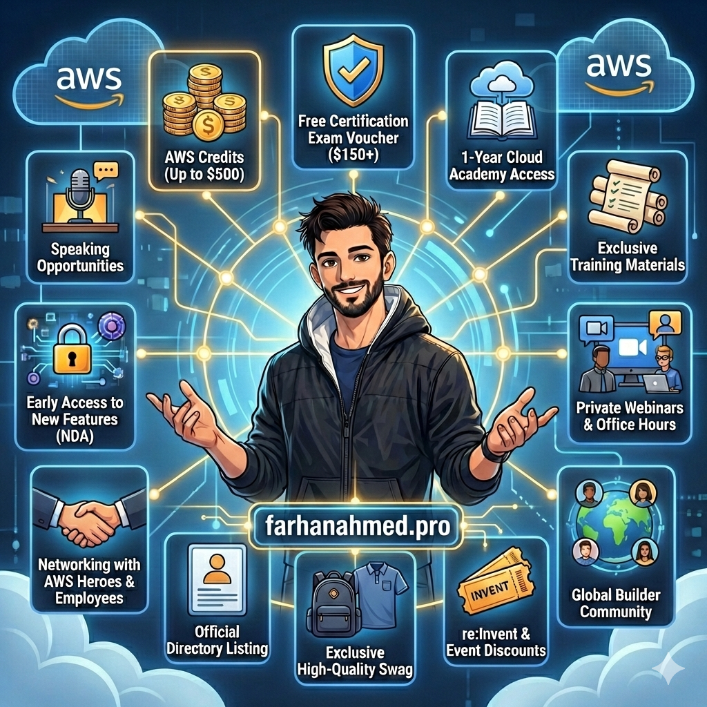

# Why You Should Apply for AWS Community Builders 2026

Hey everyone!

I've been part of the AWS Community Builders program for a while now, and honestly? It's been a game-changer for how I learn, share, and grow in the cloud space.

With 2026 applications open until **January 21, 2026 (midnight PST)**, I wanted to share why this program is absolutely worth your time - especially if you're already creating content or helping others learn AWS.

<!-- truncate -->

## 🤔 What is AWS Community Builders?

Think of it as AWS's way of supporting people who share knowledge. Whether you're writing blogs, making videos, speaking at meetups, or contributing to open source - if you're helping others learn AWS, this program is for you.

The best part? **It's completely free**. No hidden costs, no fees. Just AWS investing in people who invest in the community.

The program runs for one year, and you can reapply annually if you want to continue. Simple as that.

## 🎁 What You Actually Get

Let me break down the real benefits - not the marketing fluff, but what actually matters:

### 💰 AWS Credits (Up to $500)
This is huge. You can finally experiment with those expensive services you've been curious about. Want to try out SageMaker? Go for it. Curious about EKS? Build a cluster. No more "I'd love to learn this but it costs too much" excuses.

### 📚 Learning Resources
- Free certification exam voucher (that's $150+ saved right there)
- Access to Cloud Academy for a full year
- Training materials you won't find elsewhere

### 🔐 Behind-the-Scenes Access
Here's where it gets interesting:
- Private webinars with AWS service teams
- Office hours where you can ask real engineers your burning questions
- Early access to new features (under NDA) - you get to play with stuff before it's announced!

### 🌍 The Community
This might be the most valuable part. You join a private Slack workspace with:
- Other builders from around the world
- AWS Heroes
- AWS employees who actually build the services

Need feedback on a blog post? Ask. Stuck on an architecture problem? Someone's been there. Looking for speaking opportunities? The network is incredible.

### 🏆 Recognition & Perks
- Official directory listing
- Exclusive swag (and it's actually good swag!)
- Discounts for re:Invent and other AWS events
- Speaking opportunities at meetups and conferences

## 🚀 Why 2026 is Perfect Timing

The cloud industry is exploding right now. Everyone's talking about AI, serverless, containers - and AWS is at the center of it all.

Being an AWS Community Builder in 2026 means:
- You're positioned as someone who "gets it" in the cloud space
- Your content reaches a bigger audience through AWS amplification
- You have insider knowledge of where AWS is heading
- Your resume stands out in a crowded field

Plus, the program has matured. AWS knows what builders need and they're delivering better resources than ever.

## 💡 Who Should Apply?

You might think "I'm not qualified" - but you probably are! AWS looks for:

- **Bloggers** - Even if you've written just a few AWS posts
- **Video creators** - YouTube, TikTok, whatever platform you use
- **Open source contributors** - Built something AWS-related? Perfect.
- **Community helpers** - Answer questions on Stack Overflow? Reddit? Discord? That counts!
- **Speakers** - Given talks at meetups or conferences
- **Educators** - Teaching AWS in any capacity

You don't need to be famous. You just need to genuinely help others learn AWS.

## 🎯 My Personal Experience

Since joining, I've:
- Launched experiments I couldn't afford before
- Connected with amazing people worldwide
- Got early access to features that shaped my content strategy
- Received speaking invitations I never would have gotten otherwise
- Leveled up my AWS knowledge through direct access to service teams

The network alone has been worth it. When I have questions, I'm not googling random blog posts - I'm asking the people who built the services.

## ⏰ How to Apply (Before January 21!)

The application is straightforward:
1. Gather your best content (blogs, videos, GitHub repos, talks)
2. Write a brief summary of your community contributions
3. Explain why you want to be a builder
4. Submit before **January 21, 2026 (midnight PST)**

Don't overthink it. If you're helping others learn AWS, you belong in this program.

## 🤝 Final Thoughts

Look, I get it. Another program, another application. But this one is different.

AWS Community Builders isn't just a badge for your LinkedIn. It's a real support system that helps you grow faster, learn deeper, and connect with people who share your passion for cloud technology.

The deadline is coming up fast - **January 21, 2026**. If you've been on the fence, this is your sign to go for it.

The worst thing that happens? You don't get in this round and you try again next year. The best thing? Your cloud journey accelerates in ways you never expected.

Trust me, future you will thank present you for applying.

---

## 🤝🏻 Stay Connected

If you find this helpful and want to chat about AWS or the application process:

- Follow me on [GitHub](https://github.com/itsfarhan)
- Connect on [LinkedIn](https://linkedin.com/in/itsfarhan)
- [Support my work](https://ko-fi.com/itsfarhan) if you find it valuable

Good luck with your application! 🚀