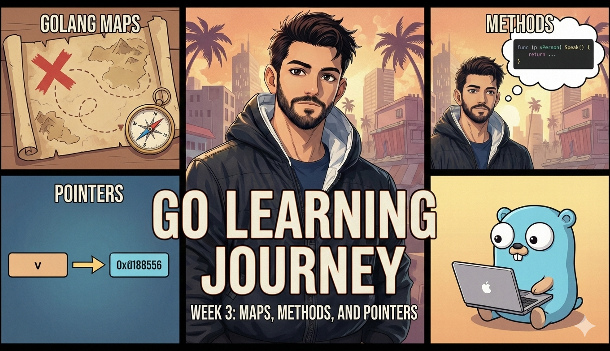

# Go Learning Journey - Week 3: Maps, Methods, and Pointers



Hey everyone!

Week 3 is done, and honestly, this week felt like leveling up. Chapters 7, 8, and 9 of "For the Love of Go" took me from basic data structures to understanding how objects work in Go, and my brain is still processing it all.

The big themes this week? Maps for fast lookups, methods for giving data behavior, and pointers for... well, that one's still sinking in. Let me break it down.


<!-- truncate -->

## 📚 What I Covered This Week

- **Chapter 7: Mapping the World** - Maps, key-value lookups, and dealing with random ordering
- **Chapter 8: Objects Behaving Badly** - Methods, receivers, and creating custom types
- **Chapter 9: Wrapper's Delight** - Wrapping types, pointers, and pass-by-value

This week was less about syntax and more about understanding how Go thinks about data and behavior.

## 🗺️ Chapter 7: Maps - Fast Lookups

Up until now, our bookstore catalog was a slice. To find a specific book, we had to loop through the entire slice checking IDs. That works, but it's not efficient.

Enter maps. A map links keys (like book IDs) to values (like Book structs). Looking up a book by ID becomes instant:

```go
catalog := map[int]Book{
    1: {ID: 1, Title: "Farhan Go-Practice"},
    2: {ID: 2, Title: "Farhan Go-Advanced"},
}

book := catalog[1]  // Instant lookup!
```

The syntax is `map[KeyType]ValueType`. In our case, `map[int]Book` means integer keys pointing to Book values.

### Adding and Updating Map Elements

Maps are mutable. You can add or update elements easily:

```go
catalog[3] = Book{ID: 3, Title: "Go Fundamentals"}  // Add new book
catalog[1] = Book{ID: 1, Title: "Updated Title"}  // Update existing
```

But here's a gotcha I hit: you can't directly modify a field of a struct stored in a map:

```go
catalog[1].Copies = 10  // Doesn't work!
```

The fix? Look up the element, store it in a variable, modify it, then write it back:

```go
b := catalog[1]
b.Copies = 10
catalog[1] = b
```

Annoying at first, but makes sense once you understand how maps work internally.

## 🔍 Checking if a Key Exists

What happens when you look up a key that doesn't exist? You get the zero value for that type:

```go
book := catalog[999]  // Returns empty Book{}
```

This is problematic because you can't tell if the book actually exists with zero values or if it's just missing. The solution? The "comma ok" idiom:

```go
book, ok := catalog[999]
if !ok {
    return Book{}, errors.New("book not found")
}
```

The second return value `ok` is `true` if the key exists, `false` otherwise. Super handy for error handling!

### Better Error Messages

Instead of generic errors, we can use `fmt.Errorf` to interpolate data:

```go
return Book{}, fmt.Errorf("book with ID %d not found", ID)
```

Way more helpful than just "book not found"!

## 🎲 The Random Ordering Problem

Here's where things got weird. I wrote a test for `GetAllBooks` that converts our map to a slice. Sometimes it passed, sometimes it failed. Same code, different results each run.

Turns out, maps in Go have no defined order. When you loop over a map with `range`, the order is intentionally randomized each time. This is by design!

The fix? Sort the results before comparing:

```go
sort.Slice(got, func(i, j int) bool {
    return got[i].ID < got[j].ID
})
```

This uses a function literal (anonymous function) to tell `sort.Slice` how to order elements. In our case, by ID.

## 🎯 Chapter 8: Methods - Data with Behavior

Chapter 8 was a mind shift. Up until now, our Book struct just stored data. But what if books could do things?

We added price and discount fields:

```go
type Book struct {
    Title           string
    Author          string
    Copies          int
    ID              int
    PriceCents      int
    DiscountPercent int
}
```

To calculate the discounted price, we could write a function:

```go
func NetPriceCents(b Book) int {
    saving := b.PriceCents * b.DiscountPercent / 100
    return b.PriceCents - saving
}
```

But Go gives us a better way: methods.

### Defining Methods

A method is like a function, but it belongs to a type. Here's `NetPriceCents` as a method:

```go
func (b Book) NetPriceCents() int {
    saving := b.PriceCents * b.DiscountPercent / 100
    return b.PriceCents - saving
}
```

The `(b Book)` part is called the receiver. It's the object the method is called on. Now we can do:

```go
book := Book{PriceCents: 4000, DiscountPercent: 25}
price := book.NetPriceCents()  // Returns 3000
```

Way cleaner! The method feels like it's part of the book itself.

### Methods on Custom Types

You can only add methods to types you own. You can't add a method to `int` because you didn't define it. But you can create your own type based on `int`:

```go
type MyInt int

func (i MyInt) Twice() MyInt {
    return i * 2
}
```

Now `MyInt` has a `Twice` method! But remember, `MyInt` and `int` are different types. You need type conversion:

```go
x := MyInt(9)
result := x.Twice()  // Returns MyInt(18)
```

### Creating a Catalog Type

We applied this to our bookstore. Instead of passing `map[int]Book` everywhere, we created a `Catalog` type:

```go
type Catalog map[int]Book

func (c Catalog) GetAllBooks() []Book {
    result := []Book{}
    for _, b := range c {
        result = append(result, b)
    }
    return result
}
```

Now `GetAllBooks` is a method on `Catalog`:

```go
catalog := Catalog{
    1: {ID: 1, Title: "For the Love of Go"},
}
books := catalog.GetAllBooks()
```

This feels so much more natural!

## 📦 Chapter 9: Wrapping Types

Chapter 9 introduced `strings.Builder`, a standard library type for efficiently building strings:

```go
var sb strings.Builder
sb.WriteString("Hello, ")
sb.WriteString("Gophers!")
result := sb.String()  // "Hello, Gophers!"
```

But what if we want to extend `strings.Builder` with our own methods?

### The Wrapping Pattern

We can't add methods to `strings.Builder` directly (we don't own it). But we can wrap it in a struct:

```go
type MyBuilder struct {
    Contents strings.Builder
}

func (mb MyBuilder) Hello() string {
    return "Hello, Gophers!"
}
```

Now we can use both the original methods and our custom ones:

```go
var mb MyBuilder
mb.Contents.WriteString("Hi!")
greeting := mb.Hello()
```

This pattern lets you extend any type with new behavior!

## 🔗 Pointers - The Mind Bender

Chapter 9 ended with pointers, and honestly, this is where my brain started hurting.

Here's the problem: when you pass a variable to a function, Go passes a copy of the value, not the original variable. This is called "pass by value":

```go
func Double(input int) {
    input *= 2  // Modifies the copy, not the original
}

x := 12
Double(x)
// x is still 12!
```

The `Double` function modifies its local `input` variable, but that doesn't affect `x` back in the calling code.

### The & Operator

To let a function modify the original variable, we use the `&` operator to create a pointer:

```go
Double(&x)  // Pass a pointer to x
```

The `&` is like the "sharing operator" - it lets you share the variable with the function so it can modify it.

I'm still wrapping my head around this. The chapter ended here, so I'm guessing next week will dive deeper into pointers and how they work.

## 💡 Key Insights This Week

1. **Maps are for fast lookups** - No more looping through slices to find things
2. **Maps have no order** - Don't rely on iteration order, it's random by design
3. **Methods make code cleaner** - Data with behavior feels more natural
4. **You can only add methods to types you own** - But you can create new types based on existing ones
5. **Wrapping extends types** - Put a type in a struct field to add new methods
6. **Pass by value is the default** - Functions get copies, not originals
7. **Pointers let you share variables** - Use `&` to let functions modify originals

## 🤔 Challenges I Faced

The random map ordering was confusing at first. My test would pass, then fail, then pass again. Learning that this is intentional behavior was a relief - I wasn't going crazy!

Understanding the difference between functions and methods took some mental adjustment. Methods feel like they "belong" to the data, which is a different way of thinking.

The wrapping pattern was tricky. Why create a struct with one field? But once I saw how it lets you extend types you don't own, it clicked.

Pointers... yeah, still processing that one. The concept makes sense, but I need more practice to really get it.

## 💭 What I Love So Far

Maps are a game-changer. The bookstore code is so much cleaner now with instant lookups instead of loops.

Methods make code read more naturally. `book.NetPriceCents()` just feels right compared to `NetPriceCents(book)`.

The type system is growing on me. Creating custom types like `Catalog` makes the code more self-documenting.

The wrapping pattern is clever. It's a simple way to extend any type without inheritance or complex OOP patterns.

## 📈 What's Next?

Next week I'm expecting to dive deeper into pointers. Chapter 9 introduced them but didn't fully explain how they work. I'm curious (and slightly nervous) to see where this goes.

I'm also wondering if we'll learn about pointer receivers for methods, since we've only seen value receivers so far.

The bookstore project is really taking shape. We've got maps for storage, methods for behavior, and proper error handling. Feels like a real application now!

## 🔗 Code Repository

All my practice code is on GitHub: [go-learning-journey](https://github.com/itsfarhan/go-practice)

The bookstore now has a proper `Catalog` type with methods. Much cleaner than before!

## 💭 Final Thoughts

Week 3 was dense. Maps, methods, custom types, wrapping, and pointers - that's a lot to absorb. But it's all starting to connect.

The progression makes sense: we started with basic data (structs), learned to store collections (slices, maps), and now we're giving that data behavior (methods). Each concept builds on the previous one.

John Arundel's teaching style continues to impress. He doesn't just show syntax - he shows you why things work the way they do. The map ordering "bug" that turned out to be a feature? Perfect example of learning by doing.

Methods feel like a natural evolution from functions. Instead of passing data around, the data carries its own behavior. This is starting to feel like real software design, not just coding exercises.

The pointer concept is still settling in my brain. I get the theory, but I need more practice to really internalize it. Good thing there's more chapters ahead!

Looking forward to Week 4 and seeing what other Go surprises await!

---

## 🤝🏻 Stay Connected

If you find this learning journey helpful, consider:

- Following me on [GitHub](https://github.com/itsfarhan)
- Connecting on [LinkedIn](https://linkedin.com/in/itsfarhan)
- [Supporting my work](https://ko-fi.com/itsfarhan) if you find it valuable

I hope you find something useful here, and I look forward to sharing more as I continue learning Go!

Happy coding! 🚀
