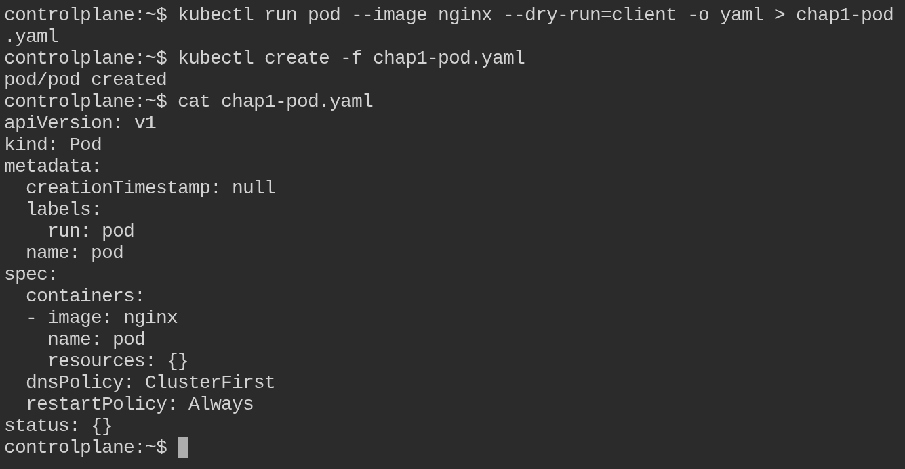
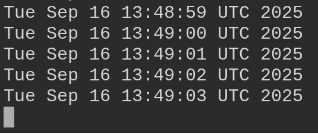
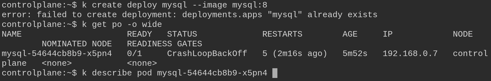
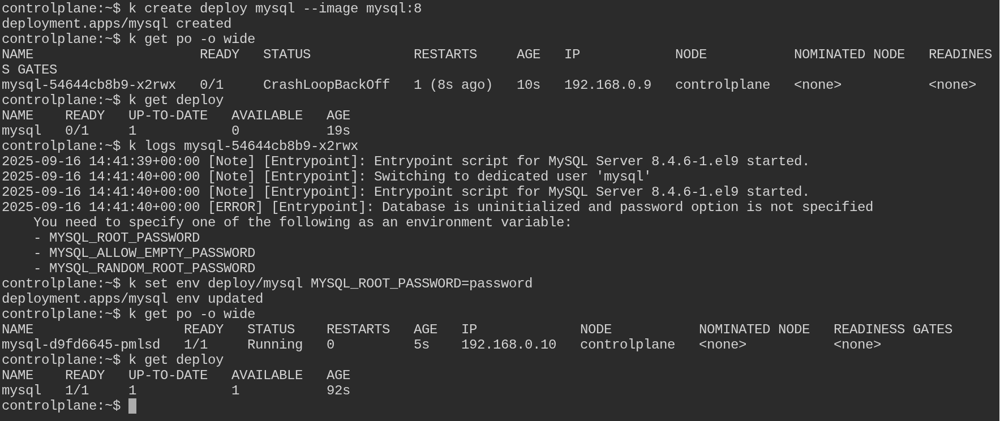
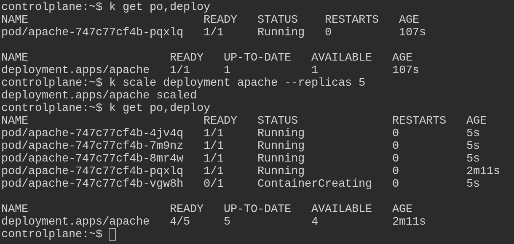
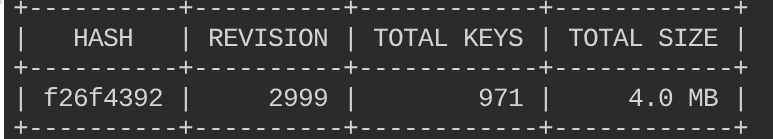
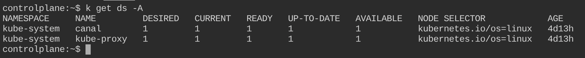

# Kubernetes Exercises

## Table of Contents
- [Basic Commands](#basic-commands)
- [Pod Creation](#pod-creation)
- [Logging Exercises](#logging-exercises)
- [ConfigMaps](#configmaps)
- [Deployments](#deployments)
- [Pod Restart Policy](#pod-restart-policy)
- [Pod Scheduling](#pod-scheduling)
- [Service Accounts](#service-accounts)
- [Deployment Rollbacks](#deployment-rollbacks)
- [Rollout Strategies](#rollout-strategies)
- [Taints and Tolerations](#taints-and-tolerations)
- [Certificates and Authentication](#certificates-and-authentication)
- [Kubernetes PKI](#kubernetes-pki)
- [Cluster Upgrades](#cluster-upgrades)
- [ETCD Backup and Restore](#etcd-backup-and-restore)

## Basic Commands

### Quick SSH: Check and Restart kubelet

```bash
# SSH into a node
ssh user@node-ip # or ssh <nodename>

# Check kubelet status
sudo systemctl status kubelet -n 20

# If you see kubelet inactive or dead, start again
sudo systemctl start kubelet

# Verify
sudo systemctl status kubelet

# Then exit from the node
exit

# In control plane check k8s nodes
kubectl get nodes
```

### List API Resources
List all API resources in your Kubernetes cluster. Save the output to a file named "resources.csv".

```bash
kubectl api-resources > resources.csv # '>' saves result into resources.csv
```

### List Linux Services
List the services on your Linux operating system that are associated with Kubernetes. Save the output to a file named services.csv.

```bash
# List unit files with systemctl and grep for 'kube'
sudo systemctl list-unit-files --type service --all | grep kube > services.csv
```

### Get Kubelet Status
List the status of the kubelet service running on the Kubernetes node and output the result to a file named kubelet-status.txt saving the file in the /tmp directory.

```bash
sudo systemctl status kubelet > /tmp/kubelet-status.txt
```

### List Kubernetes Services
List all the services and save the output to a file named services.txt using kubectl command.

```bash
kubectl get svc -A > services.txt
```
Check your services.txt with `cat services.txt`

### List Pods and IP Addresses
List all the pods in the kube-system namespace along with their IP addresses and save the output to a file named pods.txt.

```bash
kubectl -n kube-system get pods -o wide > pods.txt
```
Check your pods.txt with `cat pods.txt`

## Pod Creation

### Create a Pod Declaratively
Create a YAML file using **kubectl** for a pod named pod that uses the image nginx.

```bash
kubectl run pod --image nginx --dry-run=client -o yaml > my-pod.yaml
```
This command helps you generate a preconfigured YAML file where you can make changes according to your requirements.

**Generated my-pod.yaml:**
```yaml
apiVersion: v1
kind: Pod
metadata:
  creationTimestamp: null
  labels:
    run: pod
  name: pod
spec:
  containers:
  - image: nginx
    name: pod
    resources: {}
  dnsPolicy: ClusterFirst
  restartPolicy: Always
status: {}
```

**Create the pod:**
```bash
kubectl create -f my-pod.yaml
```



## Logging Exercises

### Create a Pod that Logs to STDOUT
Create a pod with one container that will log to STDOUT. Use kubectl to view the logs from this container within the pod named "pod-logging".

**Create pod-logging.yaml:**
```bash
cat << EOF > pod-logging.yaml
apiVersion: v1
kind: Pod
metadata:
  name: pod-logging
spec:
  containers:
  - name: main
    image: busybox
    args: [/bin/sh, -c, 'while true; do echo $(date); sleep 1; done']
EOF
```

**Create and view logs:**
```bash
kubectl create -f pod-logging.yaml

kubectl logs pod-logging

kubectl logs pod-logging -f  # -f is for follow
```


### Create a Pod with Sidecar Container

**What is a sidecar container?**
A sidecar container is a secondary container that runs alongside the main application container in a pod. It typically provides auxiliary functions such as logging, monitoring, or proxying.

**Task:** Create a pod that will have two containers, one main container and another sidecar container that will collect the main container's logs. Use kubectl to view the logs from the container named "sidecar".

**Create pod-logging-sidecar.yaml:**
```bash
cat << EOF > pod-logging-sidecar.yaml
apiVersion: v1
kind: Pod
metadata:
  name: pod-logging-sidecar 
spec:
  containers:
  - image: busybox
    name: main
    args: [ 'sh', '-c', 'while true; do echo "$(date)\n" >> /var/log/main-container.log; sleep 5; done' ]
    volumeMounts:
      - name: varlog
        mountPath: /var/log
  - name: sidecar
    image: busybox
    args: [ /bin/sh, -c, 'tail -f /var/log/main-container.log' ]
    volumeMounts:
      - name: varlog
        mountPath: /var/log
  volumes:
    - name: varlog
      emptyDir: {}
EOF
```

**Create and view logs:**
```bash
kubectl create -f pod-logging-sidecar.yaml

kubectl logs pod-logging-sidecar -c sidecar # -c is for container name

kubectl logs pod-logging-sidecar --all-containers

kubectl logs pod-logging-sidecar --all-containers -f # -f is for follow
```

### Create and Fix MySQL Deployment

**Create a deployment named "mysql" that uses the image "mysql:8":**
```bash
kubectl create deploy mysql --image mysql:8
```

**View the deployment and pod, and find out why it's not running:**
```bash
kubectl get po -o wide
# You can see an error with mysql pod; mentioned as CrashLoopBackOff or ImagePullBackOff
kubectl describe pod mysql-xxxx # replace xxxx with your pod id

kubectl get deploy

kubectl logs mysql-xxxx # replace xxxx with your pod id
```


**Fix the deployment to get the pod in a running state:**

**Method 1:**
```bash
kubectl edit deploy mysql
```
Add the following env section under spec.template.spec.containers[0]:
```yaml
env:
  - name: MYSQL_ROOT_PASSWORD
    value: "password"
```

**Method 2:**
```bash
kubectl set env deploy/mysql MYSQL_ROOT_PASSWORD=password

kubectl get po -o wide
```


## ConfigMaps

### Create a ConfigMap
Create a configmap named redis-config. Within the configMap, use the **key** `maxmemory` with **value** `2mb` and **key** `maxmemory-policy` with **value** `allkeys-lru`.

**Quickly create a YAML file for the configMap:**
```bash
kubectl create cm -h # for help

kubectl create cm redis-config --from-literal=redis.conf=config --dry-run=client -o yaml > redis-config.yaml
```

**Open the file redis-config.yaml and insert the multi-line values for redis.conf:**

```yaml
apiVersion: v1
data:
  redis.conf: |
    maxmemory 2mb
    maxmemory-policy allkeys-lru
kind: ConfigMap
metadata:
  creationTimestamp: null
  name: redis-config
```

**Create the configMap from the file:**
```bash
kubectl apply -f redis-config.yaml
```

### Create Pod with ConfigMap
Create a pod named `redis-pod` that uses the image redis:7 and exposes port 6379. Use the command `redis-server` `/redis-master/redis.conf` to store redis configuration data and store this in an `emptyDir` volume.

Mount the `redis-config` configmap as a volume to the pod for use within the container.

```bash
kubectl run redis-pod --image=redis:7 --port 6379 --command 'redis-server' '/redis-master/redis.conf' --dry-run=client -o yaml > redis-pod.yaml
```

**Open the file redis-pod.yaml and modify it to include the volume and volumeMount sections:**

```yaml
apiVersion: v1
kind: Pod
metadata:
  labels:
    run: redis-pod
  name: redis-pod
spec:
  containers:
  - command:
    - redis-server
    - /redis-master/redis.conf
    image: redis:7
    name: redis-pod
    volumeMounts:
      - name: config-volume
        mountPath: /redis-master
    ports:
    - containerPort: 6379
  volumes:
    - name: config-volume
      configMap:
        name: redis-config
```

**Create the pod from the file:**
```bash
kubectl apply -f redis-pod.yaml
```

**Why are we using configMap as volume?**
Using a ConfigMap as a volume allows you to decouple configuration data from container images, making it easier to manage and update configurations without rebuilding images. It also enables sharing configuration data across multiple pods and containers, promoting consistency and reducing duplication.

### Check Pod Configuration Settings
Get a shell to the redis-pod pod and open the redis cli to confirm the values have been applied.

**Get inside redis-pod and use redis cli:**
```bash
kubectl exec -it redis-pod -- sh
```

**Once inside redis shell, run the following commands to get the `maxmemory` and `maxmemory-policy` configuration setting:**
```bash
redis-cli
config get maxmemory
config get maxmemory-policy
```


## Deployments

### Create and Scale Apache Deployment

**Create a deployment named "apache" that uses the image httpd:latest:**
```bash
kubectl create deploy apache --image httpd:latest

kubectl get po,deploy
```

**Scale the deployment named 'apache' to 5:**
```bash
# Scale the apache deployment to 5 replicas
kubectl scale deploy apache --replicas 5

# List the now 5 pods in the deployment
kubectl get deploy,po
```



### Change Deployment Image

**Create a deployment named "apache" that uses the image `httpd:2.4.54` and contains three pod replicas:**
```bash
kubectl create deploy apache --image=httpd:2.4.54 --replicas 3

# List the deployment and the pods in that deployment
kubectl get deploy,po
```

**Scale the deployment named 'apache' from 3 replicas to 5:**
```bash
kubectl scale deploy apache --replicas 5

kubectl get po,deploy
```

**Change the image used for the pods in the 'apache' deployment to `httpd:alpine`:**
```bash
kubectl set image deploy/apache httpd=httpd:alpine

kubectl get deploy apache -o yaml | grep image
```

## Pod Restart Policy

### Create Pod with Restart Policy
Create a pod named **busybox** that has `busybox` image.

```bash
kubectl run busybox --image busybox
```
`kubectl get po` will show you CrashLoopBackOff error and trying to restart automatically.

**Change the restartPolicy to prevent the pod from automatically restarting:**

```bash
kubectl edit po busybox
```

```yaml
# pod.yaml
apiVersion: v1
kind: Pod
metadata:
  labels:
    run: busybox
  name: busybox
spec:
  containers:
  - image: busybox
    name: busybox
  restartPolicy: Never # change this from Always to Never
```

## Pod Scheduling

### Schedule Pod to Specific Node
Create a pod named ctrl-pod which uses the nginx image in your created namespace. This pod should be scheduled to the control plane node.

```bash
kubectl -n my-namespace run ctrl-pod --image nginx --dry-run=client -o yaml > my-pod.yaml
```

**Generated YAML:**
```yaml
apiVersion: v1
kind: Pod
metadata:
  creationTimestamp: null
  labels:
    run: ctrl-pod
  name: ctrl-pod
  namespace: my-namespace
spec:
  containers:
  - image: nginx
    name: ctrl-pod
    resources: {}
  dnsPolicy: ClusterFirst
  restartPolicy: Always
status: {}
```

### Create Pod with Node Affinity
Create a pod named az1-pod in a namespace which uses the nginx:1.24.0 image. This pod should use node affinity, and prefer during scheduling to be placed on the node with the label availability-zone=zone1 with a weight of 80.

Also, have that same pod prefer to be scheduled to a node with the label availability-zone=zone2 with a weight of 20.

```bash
kubectl -n my-namespace run az1-pod --image nginx:1.24.0 --dry-run=client -o yaml > az1-pod.yaml
```

**Modified YAML with Node Affinity:**
```yaml
apiVersion: v1
kind: Pod
metadata:       
  creationTimestamp: null
  labels:
    run: az1-pod
  name: az1-pod
  namespace: my-namespace
spec:
  affinity:
    nodeAffinity:
      preferredDuringSchedulingIgnoredDuringExecution:
      - weight: 80
        preference:
          matchExpressions:
          - key: availability-zone
            operator: In
            values:
            - zone1
      - weight: 20            
        preference:
          matchExpressions:
          - key: availability-zone
            operator: In
            values:
            - zone2
  containers:
  - image: nginx:1.24.0
    name: az1-pod
    resources: {}
  dnsPolicy: ClusterFirst
  restartPolicy: Always
status: {}
```

**Apply the configuration:**
```bash
kubectl -n my-namespace apply -f az1-pod.yaml
```

**Node Affinity Types:**
- **requiredDuringSchedulingIgnoredDuringExecution** - Mandatory affinity. Pod only scheduled on nodes meeting criteria. If no nodes available, pod remains unscheduled.
- **preferredDuringSchedulingIgnoredDuringExecution** - Optional affinity. Scheduler tries to place pod on preferred nodes, but can schedule elsewhere if needed.

## Service Accounts

### Create Service Account for Pod
Create a new service account named 'secure-sa' in the default namespace that will not automatically mount the service account token.

**Create service account YAML:**
```bash
# Create the YAML for a service account named 'secure-sa' with the '--dry-run=client' option
kubectl -n default create sa secure-sa --dry-run=client -o yaml > sa.yaml
```

**Add automount configuration:**
```bash
# Add the automountServiceAccountToken: false to the end of the file 'sa.yaml'
echo "automountServiceAccountToken: false" >> sa.yaml
```

**Create and verify service account:**
```bash
# Create the service account from the file 'sa.yaml'
kubectl create -f sa.yaml

# List the newly created service account
kubectl -n default get sa
```

### Create Pod with Service Account
Create a pod that uses the previously created 'secure-sa' service account. Make sure the token is not exposed to the pod!

**Create pod YAML:**
```bash
# Create the YAML for a pod named 'secure-pod' using the service account
kubectl -n default run secure-pod --image=nginx --serviceaccount=secure-sa --dry-run=client -o yaml > pod.yaml
```

**Generated pod YAML:**
```yaml
apiVersion: v1
kind: Pod
metadata:
  name: secure-pod
spec:
  serviceAccountName: secure-sa
  containers:
  - image: nginx
    name: secure-pod
```

**Create and verify pod:**
```bash
# Create the pod from the file 'pod.yaml'
kubectl apply -f pod.yaml

# List the pods in the default namespace and wait until the pod is running
kubectl -n default get po
```

### Verify Token is Not Mounted
```bash
# Get a shell to the pod and try to output the token (should fail)
kubectl exec secure-pod -- cat /var/run/secrets/kubernetes.io/serviceaccount/token
```

**Expected output:**
```bash
cat: /var/run/secrets/kubernetes.io/serviceaccount/token: No such file or directory
command terminated with exit code 1
```

This confirms that the service account token is not mounted to the pod, providing better security.

## Deployment Rollbacks

### Rollback a Deployment
Create a deployment named "apache" that uses the image httpd.

```bash
kubectl create deploy apache --image httpd

kubectl get deploy,po
```

**Change the image from httpd to httpd:2.4.54. List the events of the replicasets in the cluster:**
```bash
kubectl set image deploy/apache httpd=httpd:2.4.54

kubectl describe rs
```

**Roll back to a previous version of the deployment (the deployment with the image httpd):**
```bash
kubectl rollout history deploy apache

kubectl rollout undo deploy apache

kubectl rollout status deploy apache
```

## Rollout Strategies

### Change Rollout Strategy
Create a deployment named source-ip-app that uses the image registry.k8s.io/echoserver:1.4.

```bash
kubectl create deploy source-ip-app --image registry.k8s.io/echoserver:1.4

kubectl get deploy,pod
```

**For the deployment named source-ip-app, change the rollout strategy to "Recreate":**
```bash
# Edit the deployment and change the rollout strategy to recreate
kubectl edit deploy source-ip-app
```

**In the deployment YAML, modify the 'strategy'. Save and quit to apply the changes:**
```yaml
spec:
  progressDeadlineSeconds: 600
  replicas: 5
  revisionHistoryLimit: 10
  selector:
    matchLabels:
      app: source-ip-app
  strategy:
    type: Recreate
```

**Verify the strategy change:**
```bash
kubectl get deploy source-ip-app -o yaml | grep strategy -A3
```

**Change the image used in the source-ip-app deployment to registry.k8s.io/echoserver:1.3:**
```bash
# Change the image used for the 'source-ip-app' deployment
kubectl set image deploy source-ip-app echoserver=registry.k8s.io/echoserver:1.3

# Quickly check the pod as they recreate. Notice how the old version of the pod is deleted immediately, not waiting for the new pods to create.
kubectl get po
```

## Taints and Tolerations

### What are Taints and Tolerations?
Taints and tolerations are mechanisms in Kubernetes that work together to ensure that pods are not scheduled onto inappropriate nodes. Taints are applied to nodes, while tolerations are applied to pods. A node with a taint will repel any pod that does not have a matching toleration.

### List Node Taints
**List the taints for node01:**
```bash
kubectl describe node node01 | grep -i taint

# Output:
Taints:             dedicated=special-user:NoSchedule
```

### Create Pod with Toleration
**Create a basic pod named nginx that uses the image nginx:**
```bash
kubectl run nginx --image=nginx --dry-run=client -o yaml > pod.yaml
```

**View the file and apply the correct toleration to this pod manifest for it to successfully get scheduled to node01.**

**Before Toleration:**
```yaml
apiVersion: v1
kind: Pod
metadata:
  labels:
    run: nginx
  name: nginx
spec:
  containers:
  - image: nginx
    name: nginx
```

**After Toleration:**
```yaml
apiVersion: v1
kind: Pod
metadata:
  labels:
    run: nginx
  name: nginx
spec:
  tolerations:
  - key: "dedicated"
    value: "special-user"
    effect: "NoSchedule"
  containers:
  - image: nginx
    name: nginx
```

**Update and view the pod:**
```bash
# Update the pod
kubectl apply -f pod.yaml

# View the pod running
kubectl get po -o wide
```

**What happens if you don't add the toleration?**
If you try to create a pod on node01 without a toleration, the pod will not be scheduled on that node due to the taint present on the node. The Kubernetes scheduler will prevent the pod from being placed on the node until a matching toleration is added to the pod specification.

### Add Toleration to Pod
**Create pod with nodeSelector:**
```bash
cat << EOF | kubectl apply -f -
apiVersion: v1
kind: Pod
metadata:
  creationTimestamp: null
  labels:
    run: nginx
  name: nginx
spec:
  containers:
  - image: nginx
    name: nginx
  nodeSelector:
    kubernetes.io/hostname: controlplane
EOF
```

**View the pod:**
```bash
kubectl get po -o wide
```

**Add the toleration for the taint that's applied to the controlplane node:**
```yaml
apiVersion: v1
kind: Pod
metadata:
  creationTimestamp: null
  labels:
    run: nginx
  name: nginx
spec:
  containers:
  - image: nginx
    name: nginx
  nodeSelector:
    kubernetes.io/hostname: controlplane
  tolerations:
  - key: "node-role.kubernetes.io/control-plane"
    operator: "Exists"
    effect: "NoSchedule"
```

**Apply and view the pod:**
```bash
kubectl apply -f pod.yaml

# View the pod
kubectl get po -o wide
```

### Remove Taint from Node
**If the pod is not running, fix the pod:**
```bash
# Describe the pod to see issues
kubectl describe po nginx

# Describe the controlplane node to view the taint applied
kubectl describe no controlplane | grep Taint

# Get the pod to run on the control plane by removing the taint
kubectl taint no controlplane node-role.kubernetes.io/control-plane:NoSchedule-

# Check to see if the pod is now running and scheduled to the control plane node
kubectl get po -o wide
```

## Certificates and Authentication

### Create Certificate Signing Request (CSR)
**Generate a private key and certificate signing request for a user named "carlton":**

```bash
# Generate private key
openssl genrsa -out carlton.key 2048

# Generate certificate signing request
openssl req -new -key carlton.key -out carlton.csr -subj "/CN=carlton"
```

**Important:** Make sure to include the Common Name (CN) into your CSR, or else the certificate will become invalid.

### Submit CSR to Kubernetes API
**Store the CSR value in an environment variable:**
```bash
export REQUEST=$(cat carlton.csr | base64 -w 0)
```

**Create and submit the CSR to Kubernetes:**
```bash
cat <<EOF | kubectl apply -f -
apiVersion: certificates.k8s.io/v1
kind: CertificateSigningRequest
metadata:
  name: carlton
spec:
  groups:
  - system:authenticated
  request: $REQUEST
  signerName: kubernetes.io/kube-apiserver-client
  usages:
  - client auth
EOF

# Verify the CSR was created
kubectl get csr
```

### Approve CSR and Extract Certificate
**Approve the CSR:**
```bash
kubectl certificate approve carlton

# Verify the CSR was approved
kubectl get csr
```

**Extract the client certificate:**
```bash
kubectl get csr carlton -o jsonpath='{.status.certificate}' | base64 -d > carlton.crt
```

### Configure kubectl with New User
**Set credentials in kubeconfig:**
```bash
kubectl config set-credentials carlton --client-key=carlton.key --client-certificate=carlton.crt --embed-certs
```

**💡 TIP:** You can remove the `--embed-certs` flag and they will remain pointers to the key and certificate files.

**Set and use the context:**
```bash
kubectl config set-context carlton --user=carlton --cluster=kubernetes

kubectl config use-context carlton

# Test if pods are running in web namespace
kubectl -n web get pods
```

### View Kubelet Client Certificate
**View the client certificate that the kubelet uses to authenticate to the Kubernetes API:**

```bash
# View the kubelet client certificate and output to a file
cat /etc/kubernetes/kubelet.conf > kubelet-config.txt

# View the certificate using openssl
openssl x509 -in /var/lib/kubelet/pki/kubelet-client-current.pem -text -noout
```

## Kubernetes PKI

### PKI Essentials
The Kubernetes PKI is a set of public key infrastructure (PKI) components that secure communication between cluster components:

- **Certificates** - Used to authenticate and encrypt communication between components
- **Keys** - Used to encrypt and decrypt communication between components

### Explore Certificates
**Peek inside the certificates:**
```bash
# View API server certificate
sudo openssl x509 -in /etc/kubernetes/pki/apiserver.crt -noout -text | egrep 'Subject:|Issuer:|DNS:|IP Address:'

# View CA certificate
sudo openssl x509 -in /etc/kubernetes/pki/ca.crt -noout -text | egrep 'Subject:|Issuer:'

# See how kubectl uses them
sudo egrep -n 'certificate-authority|client-certificate|client-key' /etc/kubernetes/admin.conf
```

**Observation:** admin.conf references the CA and a client cert/key from /etc/kubernetes/pki. This is how kubectl proves who you are to the API server.

### Test PKI Security
**Temporarily hide the API server's TLS private key:**
```bash
sudo mv /etc/kubernetes/pki/apiserver.key /etc/kubernetes/pki/apiserver.key.bak
```

**Open another terminal and monitor kubelet logs:**
```bash
sudo journalctl -u kubelet -f
```

**In the first terminal, trigger API server restart:**
```bash
# Trigger the kubelet to restart the kube-apiserver static pod
sudo sed -i '1s/^/# trigger reload\n/' /etc/kubernetes/manifests/kube-apiserver.yaml

# Delete the running apiserver container via crictl
sudo crictl ps | awk '/kube-apiserver/{print $1}' | xargs -r sudo crictl rm -f

# Restart kubelet
sudo systemctl restart kubelet

# Test connectivity (should fail)
kubectl get nodes
```

**Restore the key:**
```bash
sudo mv /etc/kubernetes/pki/apiserver.key.bak /etc/kubernetes/pki/apiserver.key

# Verify recovery (may take a minute or two)
kubectl get --raw='/readyz?verbose' | head
kubectl get nodes
```

**Key Takeaways:**
- `/etc/kubernetes/pki` contains the crown jewels of a kubeadm control plane's security
- Certificates and keys allow API server, controller-manager, scheduler, and kubelet to trust each other
- The API server is a static Pod; kubelet continuously tries to restart it if something goes wrong
- admin.conf references the CA and client cert/key, letting kubectl authenticate

## Cluster Upgrades

### Kubeadm Installation
For detailed kubeadm installation instructions, refer to the official Kubernetes documentation or kubeadm setup guides.

### Upgrading Kubernetes
**Check current and target versions:**
```bash
# Check the current and target version of control plane components
kubeadm upgrade plan
```

**Upgrade kubeadm first:**
```bash
# Check current kubeadm version
kubeadm version -o json | jq

# Upgrade kubeadm
sudo apt install -y kubeadm=1.30.1-1.1
```

**Upgrade control plane components:**
```bash
# Run upgrade plan again
kubeadm upgrade plan

# Upgrade components
kubeadm upgrade apply v1.30.1

# For forced upgrade (if needed)
kubeadm upgrade apply v1.33.5 --force
```

**Note:** You may receive this message: "Specified version to upgrade to 'v1.30.1' is higher than the kubeadm version 'v1.30.0'. Upgrade kubeadm first using the tool you used to install kubeadm"

## ETCD Backup and Restore

### Backup ETCD
**Set up environment for etcdctl:**
```bash
export ETCDCTL_API=3
```

**💡 TIP:** etcd has its own server certificate which requires a valid client certificate and key located in `/etc/kubernetes/pki/etcd`

**Create ETCD snapshot:**
```bash
etcdctl snapshot save snapshot --cacert /etc/kubernetes/pki/etcd/ca.crt --cert /etc/kubernetes/pki/etcd/server.crt --key /etc/kubernetes/pki/etcd/server.key

# Check the status of your snapshot
etcdctl snapshot status snapshot --write-out table
```


### Simulate Disaster
**Delete kube-proxy daemonset to simulate disaster:**
```bash
kubectl delete ds kube-proxy -n kube-system

# Verify that this daemonset no longer exists
kubectl get ds -A
```

### Restore from Backup
**💡 TIP:** The kubelet runs the etcd pod directly (without kube-scheduler) and picks up the manifest in `/etc/kubernetes/manifests/etcd.yaml`

**Restore from snapshot:**
```bash
etcdctl snapshot restore snapshot --data-dir /var/lib/etcd-restore
```

**Update etcd manifest:**
Edit `/etc/kubernetes/manifests/etcd.yaml` and change line 88:
```yaml
  - hostPath:
      path: /var/lib/etcd-restore # CHANGE THIS LINE
      type: DirectoryOrCreate
    name: etcd-data
```

**⛔ STOP:** The Kubernetes API will be unavailable until the etcd pod is restarted. This may take up to 3 minutes.

**Verify restoration:**
```bash
# Verify kube-proxy daemonset is restored
kubectl get ds -A
```
 